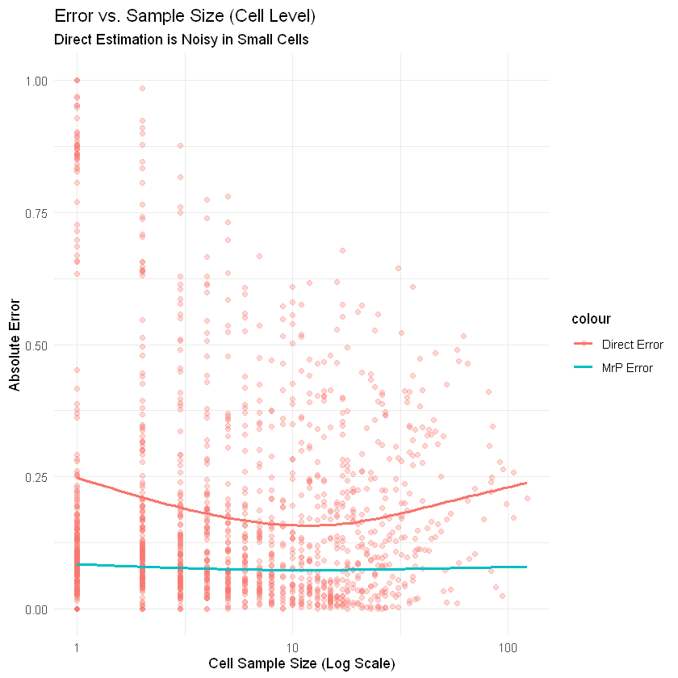
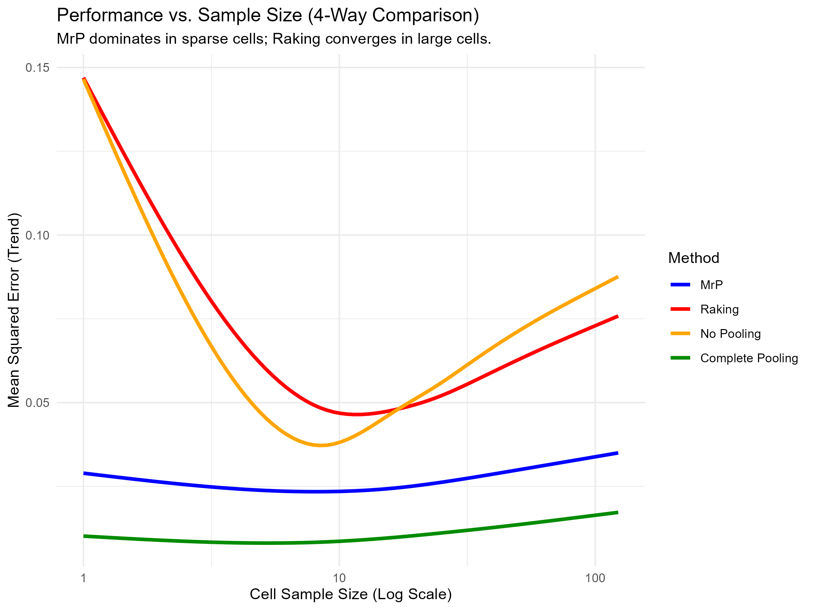
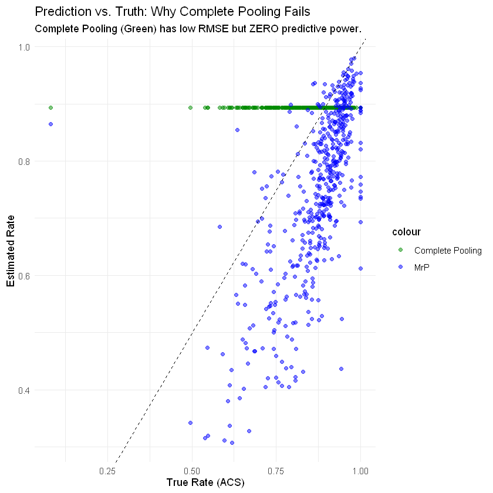

# What If Without MrP? Project Repository

This repository contains the R code and analysis pipeline for the MATH 5472 course project: **"What If Without MrP? Overcoming Data Sparsity and Selection Bias in Public Health Surveillance"**.

## Project Overview
This project implements **Multilevel Regression and Poststratification (MrP)** to estimate health insurance coverage across U.S. states using 2022 BRFSS and ACS data. It compares MrP against Direct Estimation, Raking, and Complete Pooling, demonstrating the "Macro-Micro Paradox".

## Files
- `analysis.R`: The main R script that performs data cleaning, model fitting (glmer), poststratification, and visualization.
- `output_figures/`: Folder containing the generated plots used in the paper.

## How to Reproduce
Due to file size limits and data usage terms, the raw datasets are not included in this repository. Please follow these steps to reproduce the results:

1. **Download Data:**
   - **Survey Data:** Download the 2022 BRFSS Data (SAS Transport Format) from the [CDC Website](https://www.cdc.gov/brfss/annual_data/annual_2022.html). Rename it to `LLCP2022.XPT_`.
   - **Census Data:** Download the 2022 ACS 1-Year PUMS data from [IPUMS USA](https://usa.ipums.org/). Select variables: `STATEFIP`, `AGE`, `SEX`, `RACE`, `HISPAN`, `HCOVANY`, `EDUC`, `PERWT`, `GQ`. Rename the csv file to `usa_00001.csv`.

2. **Run Code:**
   - Place both data files in the same directory as `analysis.R`.
   - Run the script in RStudio.
   - Required packages: `tidyverse`, `haven`, `lme4`, `data.table`, `vroom`.

## Results
The analysis generates the following comparisons:
- **Macro-level:** Comparing state-level estimates against ACS ground truth.
- **Micro-level:** Evaluating RMSE and coverage in sparse demographic cells.
### 1. The Macro-Micro Paradox
At the state level (Macro), MrP shows a systematic offset. However, at the granular demographic level (Micro), it provides 100% coverage and superior stability.

| **Macro-level Bias (Mode Effect)** | **Micro-level Precision (Sparsity)** |
| :---: | :---: |
|  |  |
| *MrP (Blue) has a systematic offset vs. Truth* | *Direct Est. (Red) explodes in variance; MrP is stable* |

 

### 2. Comprehensive 4-Way Comparison
We extended the analysis to include Raking and Complete Pooling.

**Performance Trend by Sample Size:**

> *Figure: As sample size decreases (left side), Direct Estimation (Orange) and Raking (Red) errors explode. MrP (Blue) maintains low error in sparse cells.*

 

### 3. The Accuracy-Utility Paradox
**Why Complete Pooling Fails despite low RMSE:**

> *Figure: Complete Pooling (Green) achieves the lowest RMSE by predicting a flat line (zero variance), but it has **ZERO correlation** with the truth. In contrast, MrP (Blue, r=0.71) successfully recovers the structure of health disparities.*

## Author
Lam Kiu Yeung
HKUST
